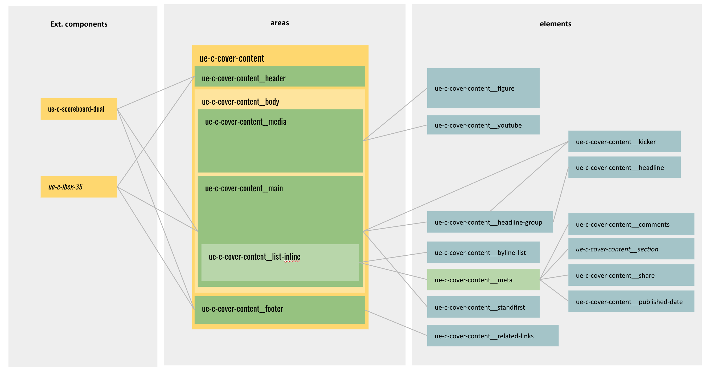
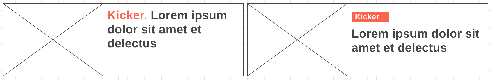
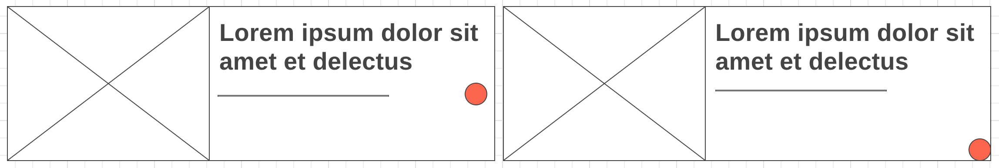
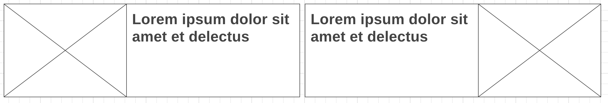
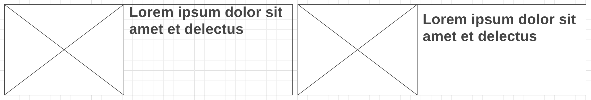
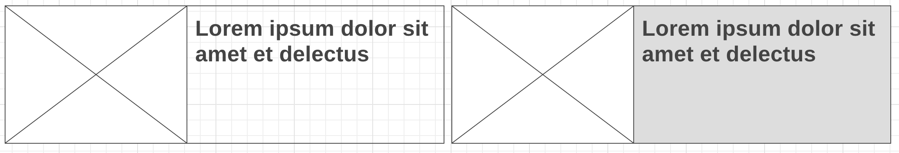

# ue-c-cover-content

An `ue-c-cover-content` is a fragment of a type of content that links to the complete content. (ex: an article, a photo album, a video)

## Install as a dependency
```
npm install -D git+ssh://git@gitlab.internet.int:fronts/ue-c-cover-content.git#{tagNumber}
```

## How to import the styles
Import the `ue-l-cover-content` main.scss file into your project
```scss
@import '~/ue-c-cover-content/scss/main';
```
This will make all the conver-content styles avaiable to your project but will not generate any code unless you make use of its mixins

### Import the compoenent and its variators

```scss
// Your scss file example

// In this file you will redefine all the scss default variables of the conver-content
@import 'your-variables-redefinition-file';
// This will make all the conver-content mixins avible
@import '~/ue-c-cover-content/scss/main';

//this will import the defaults styles of the cover-content
@include ue-c-cover-content;

//here you include all the cover-content variations that you need

// Display variations:
@include ue-c-cover-content--media2of3(tablet);
@include ue-c-cover-content--media1of2(tablet); 

// Size variations:
@include ue-c-cover-content--m(tablet);
@include ue-c-cover-content--xxl(tablet);
@include ue-c-cover-content--3xl(tablet);
```
## Overview of the conver-content
 
## Elements
Element  | Description  
--|--
ue-c-cover-content__figure | the figure of an article, the area that contain de image and its caption
ue-c-cover-content__image | the image of an article (optional)
ue-c-cover-content__media-description | text thats describe the image (optional)
ue-c-cover-content__media-source   | the author of the image (optional)
ue-c-cover-content__kicker |  A small text (1 to 3 words)
ue-c-cover-content__aboveheadline |  A text thats gives support to the headline
ue-c-cover-content__headline   |  the headline
ue-c-cover-content__link | the full content url
ue-c-cover-content__byline-list | a list of one or more content authors (optional)
ue-c-cover-content__byline-name | the name of the content author (optional)
ue-c-cover-content__byline-role | the role of the content author (optional)
ue-c-cover-content__byline-location | the location of the content author (optional)
ue-c-cover-content__comments | the number of comments of the article (optional)
ue-c-cover-content__standfirst | a text that describes more abour the article, no more than a small pharagraph (optional)
ue-c-cover-content__related-links | one or more links to related contents (title / url)
Kicker url   |  url (optional)
Date  |  the date of the article last publication (optional)
Time  |  the time of the article last publication (optional)
Share  |  list of social networks where the article can be shared (optional)

## Areas
For layout propurse, the `ue-c-cover-content` has the following areas to display the before mentioned elements:

```html
<div class="ue-c-cover-content">
    <div class="ue-c-cover-content__header">
        [[area]]
    </div>
    <article class="ue-c-cover-content__body">
        <div class="ue-c-cover-content__media">
            [[area]]
        </div>
        <div class="ue-c-cover-content__main">
            [[area]]
            <div class="ue-c-cover-content__list-inline">
                [[area]]
                <ul class="ue-c-cover-content__meta">
                    [[area]]
                </ul>
            </div>
        </div>
    </article>
    <div class="ue-c-cover-content__footer">
        [[area]]
    </div>
</div>
```

Now with some elements
```html
<div class="ue-c-cover-content">
    <article class="ue-c-cover-content__body">
        <div class="ue-c-cover-content__media">
            <figure class="ue-c-cover-content__figure" itemprop='image' itemscope='' itemtype='http://schema.org/ImageObject'>
                
                <figcaption class="ue-c-cover-content__caption">
                    <span class="ue-c-cover-content__media-description">Media description</span>
                    <span class="ue-c-cover-content__media-source">Media Source</span>
                </figcaption>
            </figure>
        </div>
        <div class="ue-c-cover-content__main">
            <span class="ue-c-cover-content__aboveheadline">Aboveheadline text</span>
            <h2 class="ue-c-cover-content__headline-group">
                <a class="ue-c-cover-content__link" href="#articleURL">
                    <span class="ue-c-cover-content__kicker">Kicker text.</span>
                    <span class="ue-c-cover-content__headline">A headlline text</span>
                </a>
            </h2>
            <div class="ue-c-cover-content__list-inline">
                <ul class="ue-c-cover-content__byline-list">
                    <li class="ue-c-cover-content__byline-item">
                        <span class="ue-c-cover-content__byline-name">Author Name</span>
                        <span class="ue-c-cover-content__byline-role">Author role</span>
                        <span class="ue-c-cover-content__byline-location">location</span>
                    </li>
                </ul>
                <ul class="ue-c-cover-content__meta">
                    <li class="ue-c-cover-content__meta-item">
                        <a href="#comentarios" class="ue-c-cover-content__comments">
                            <span>50</span>
                            <span class="is-hidden">comentarios</span>
                        </a>
                    </li>
                </ul>
            </div>
            <p class="ue-c-cover-content__standfirst">standfirst pharagraph</p>
        </div>
    </article>
    <div class="ue-c-cover-content__footer">
         <ul class="ue-c-cover-content__related-links" aria-label="Noticias relacionadas">
            <li><a href="#relatedlinksurl">Related link title</a></li>
        </ul>
    </div>
</div>
```

## Variables
__`$ue-c-cover-content-kicker-position`__ the kicker position can be styled different depending on its position in the HTML
    - value `0 (default)`: Define the kicker as an element of the content_main area
    - value `1`: Define if the kicker as part of the headline_group
For more information see the HTML variations [below](#html-variations)
  

__`$ue-c-cover-content-comments-absolute`__ set the comments to absoluted positioned inside the `ue-c-cover-content__main`
    - value `false (default)`: The comments element will styles as part of the `content_meta` area
    - value `true`: The comments element will styles as part of the `content_main` area
For more information see the HTML variations [below](#html-variations)


__`$ue-c-cover-content-horizontal-direction-row`__ its changes the direction of the main and content areas
    - value `false (default)`: the default display will be content/media
    - value `true`: the default display will be media/content


__`$ue-c-cover-content--boxed-content`__ its gives some space to the content_main area
    - value `false (default)`: its gives some separation between the media and the content
    - value `true`: its gives some separation in the top/left/bottom/right of the `cover-content_main` area


__`$ue-c-cover-content-background-color`__ define a background color


__`$ue-c-cover-content-font-family`__ A map variable to define the font-family, font-weight, color and color-hover of the different elements

__`$ue-c-cover-content-font-scale`__ A map variable to define the font-size, line-height and letter-spacing for all the predefined sizes of all elements

__`$ue-c-cover-content-gutter-scale`__ A map variable to define space between elements


## __`cover-content` modificators:__
    
- ### By Size:
    If you want to include any of these modifiers, you need to include the mixin and specify the media querie where you want the modifier to start to take effect:
    
    ```scss
    @include ue-c-cover-content--xxl(mobile);
    @include ue-c-cover-content--3xl(desktop);
    ```
    
    this will create the following css:
    ```css
    @media (min-width: 320px) {
        .ue-c-cover-content--xxl-from-mobile {
            .ue-c-cover-content__headline-group {
                font-size: 35px;
                ...
            }
        }
    }
    @media (min-width: 890px) {
        .ue-c-cover-content--3xl-from-desktop {
            .ue-c-cover-content__headline-group {
                font-size: 50px;
                ...
            }
        }
    }
    ```
    
    How to use it:
    ```html
    <article class="ue-c-cover-content ue-c-cover-content--xxl-from-mobile ue-c-cover-content--3xl-from-desktop">
        ...
    </article>
    ```

    Aviable modifiers:
    Name |  
    -- |
    `ue-c-cover-content--4xl` |
    `ue-c-cover-content--3xl` |
    `ue-c-cover-content--xxl` |
    `ue-c-cover-content--xl` |
    `ue-c-cover-content--l` |
    `ue-c-cover-content--m` |
    `ue-c-cover-content--s` |
    `ue-c-cover-content--xs` |
    `ue-c-cover-content--xxs` |
    `ue-c-cover-content--3xs` |


- ### By Display (layout):
    If you want to include any of these modifiers, you need to include the mixin and specify the media querie where you want the modifier to start to take effect:

    ```scss
    @include ue-c-cover-content--media1of2-left(tablet);
    @include ue-c-cover-content--vertical(mobile);
    ```

    this will create the following css:
    ```css
    @media (min-width: 740px) {
        .ue-c-cover-content--media1of2-left-from-tablet {
            .ue-c-cover-content__body {
                flex-direction: row-reverse;
            }
            .ue-c-cover-content__media {
                width: 50%;
            }
        }
    }
    @media (min-width: 320px) {
        .ue-c-cover-content--vertical-from-mobile {
            .ue-c-cover-content__body {
                flex-direction: column;
            }
        }
    }
    ```

    How to use it:
    ```html
    <article class="ue-c-cover-content ue-c-cover-content---vertical-from-mobile ue-c-cover-content--media1of2-left-from-tablet">
        ...
    </article>
    ```

    Aviable display modifiers:
    Name  | Description  
    --|--
    `ue-c-cover-content--2cols-related-links` | Show the related links in two columns
    `ue-c-cover-content--3cols-related-links` | Show the related links in three columns
    `ue-c-cover-content--hasimage-1col-related-links` | If the cover content has image, show related links in one column
    `ue-c-cover-content--footer-left` | Set the footer with position abolute and left 0
    `ue-c-cover-content--footer-right` |  Set the footer with position abolute and right 0
    `ue-c-cover-content--footer1of2` |  Set the footer width to 50%
    `ue-c-cover-content--footer1of3` |  Set the footer width to 100%/3
    `ue-c-cover-content--kicker-left`  | Set the kicker to position absolute in the top/left corner (only if .has-image exists)
    `ue-c-cover-content--kicker-right` |  Set the kicker to position absolute in the top/right corner (only if .has-image exists)
    `ue-c-cover-content--link-grow-200` |  To set the link ::after pseudo element grow 200%
    `ue-c-cover-content--link-grow-300` |  To set the link ::after pseudo element grow 300%
    `ue-c-cover-content--media-left` |  Show the image in the left
    `ue-c-cover-content--media-right` |  Show the image in the right
    `ue-c-cover-content--media1of2` |  set the image width to 50%
    `ue-c-cover-content--media2of3` |  set the image width to 100% /3 * 2
    `ue-c-cover-content--vertical-reverse` |  Show the content above the image
    `ue-c-cover-content--vertical` |  Show the content below the image
    
- ### By Styles:
    A cover article can be modified by styles, colors, etc.
    Aviable display modifiers:
    Name |  
    -- |
    is--highlighted |
    is--special |
    is--opinion |
    is--gallery |
    is--video |
    is--premuim |
    is--graph |

### Other modificator 
- has-image
- has-comments
- has-related-links 

```html
<div class="ue-c-cover-content ue-c-cover-content--highlighted">
    ...
</div>
```


Any of these categories (__Size__, __display__ and __styles__) can be combined 

```html
<div class="ue-c-cover-content ue-c-cover-content--xxl-from-mobile ue-c-cover-content--3xl-from-tablet ue-c-cover-content--vertical-reverse-from-mobile ue-c-cover-content--media2of3-from-phablet ue-c-cover-content--link-grow-300-from-desktop ue-c-cover-content--media-right-from-phablet ue-c-cover-content--footer1of3-from-desktop ue-c-cover-content--footer-left-from-desktop  has-image">
    ...
</div>
```


## <a id="html-variations"></a> HTML variations
The `cover-content` can vary the way its show some of the elements, they can me moved from one area to another:

- __Kicker__
    - kicker as an independent element in the content_main area:
        ```html
        ...
        <div class="ue-c-cover-content__main">
            <span class="ue-c-cover-content__kicker">Kicker text</span>
        </div>
        ...
        ```
    - kicker in headline: The kicker is showed as part of the Headline-group
        ```html
        ...
        <div class="ue-c-cover-content__main">
            <h2 class="ue-c-cover-content__headline-group">
                <a href="#" class="ue-c-cover-content__link">
                    <span class="ue-c-cover-content__kicker">kicker text</span>
                    <span class="ue-c-cover-content__headline">Headline text</span>
                </a>
            </h2>
        </div>
        ...
        ```
- __Comments__
    - Comments as an element in the list inline area:
        ```html
        ...
        <div class="ue-c-cover-content__content">
            ...
            <div class="ue-c-cover-content__list-inline">
                ...
                <ul class="ue-c-cover-content__meta">
                    <li class="ue-c-cover-content__meta-item">
                        <a href="#comentarios" class="ue-c-cover-content__comments">
                            <span>50</span>
                            <span class="is-hidden">comentarios</span>
                        </a>
                    </li>
                </ul>
            </div>
            ...
        </div>
        ...
        ```
    - Comments as an element in the content_main area
        ```html
        ...
        <div class="ue-c-cover-content__main">
            ...
            <p class="ue-c-cover-content__standfirst">standfirst pharagraph</p>
            <a href="#comentarios" class="ue-c-cover-content__comments">
                <span>50</span>
                <span class="is-hidden">comentarios</span>
            </a>
        </div>
        ...
        ```


## Other components that can be shown inside the `ue-c-cover-content`:
You can drop any component youd like as long as you drop it inside a defined area. The components must manage its own styles and must not be dependent on the `ue-c-cover-content` to behave accordinagly.
- ue-c-scoreboard-dual
- ue-c-scoreboard-multiple
- ue-c-star-ranking
- ue-c-ibex-module
